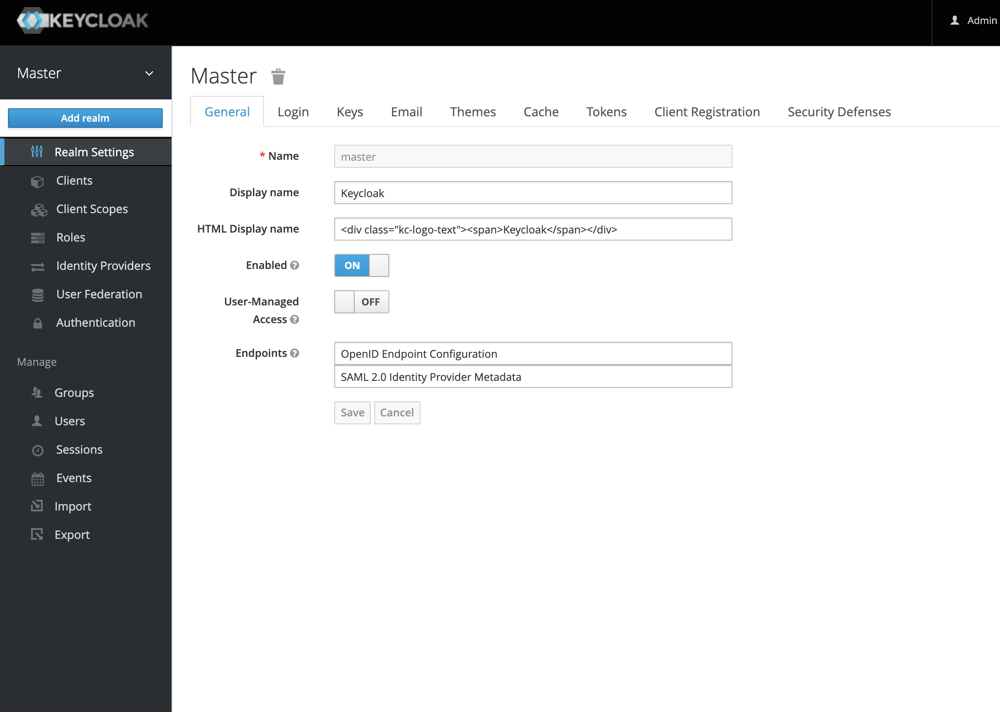
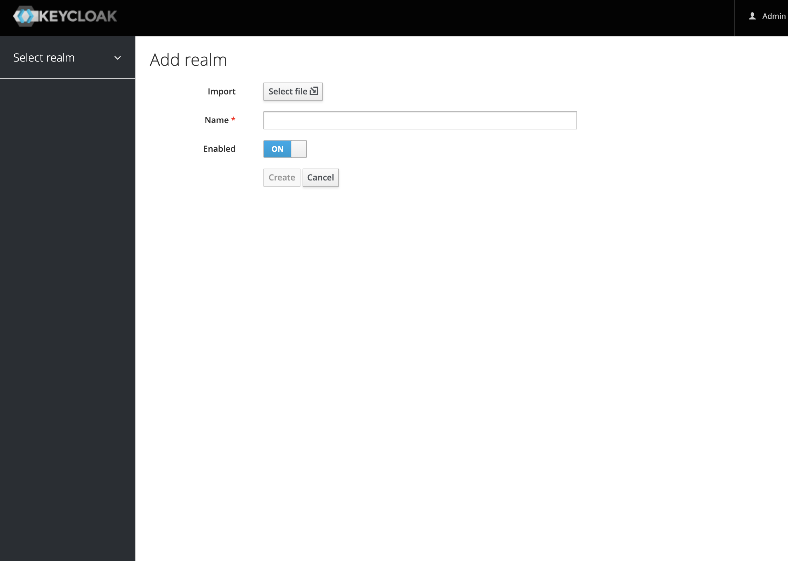

# Patternfly-Chat

  

Patternfly-Chat is a real time chat application that allows realtime communication for groups and individuals. 

It features an architecture comprised of a frontend, a cache micro service, a redis cache, and an instance of a keycloak server.

The authentication side is leveraged by Keycloak and which makes management of client applications, users, and assignment of permissions and roles extremely simple. Management of application concurrency is handled by the cache micro service which relies on composite key and streaming features of redis.

 The frontend communicates directly to keycloak server and the cache.

The frontend is React and the Cache is Node with es6 mods.

  

# Backend API

Cache API, assuming the Cache is running on http://localhost:3332.

  
#### Set Key in Cache

Ex. Store birthMonth to July and give it a time to live of 10 minutes
> curl http://localhost:3332/store/600/birthMonth\?value=July 
>
#### Get Key from Cache
Ex. get birthMonth
> curl http://localhost:3332/name/birthMonth
>
#### Delete Key
Ex. Delete birthMonth
> curl http://localhost:3332/delete/birthMonth
>
#### Fetch All Keys
> curl http://localhost:3332/all 
>
________________________________________________________________________________________________________________________________________________________ 

# Set Up
All of the resources used in this app are run in docker containers. Everything is accessible locally and extremely simple and fast to spin up.
  
  
#### Cache Service
> docker run -d -p 6379:6379 redis

#### Auth Service
> docker run -p 8080:8080 -e KEYCLOAK_USER=admin -e KEYCLOAK_PASSWORD=admin -e DB_VENDOR=H2 jboss/keycloak

  

#### go to http://localhost:8080/auth/admin

#### username: admin, password: admin

![[Login|width=100px]](login.png)

  
  

#### Hover your mouse over the top of the left panel where is says "master" and a button will appear that says Add Realm.

  

#### Upload config file from realm-export.json from KeyCloak/Realms/realm-export.json

________________________________________________________________________________________________________________________________________________________

#### Front End
> npm i && npm start

#### Cache 
> cd Cache; 
________________________________________________________________________________________________________________________________________________________ 
> npm i && npm start
________________________________________________________________________________________________________________________________________________________ 
